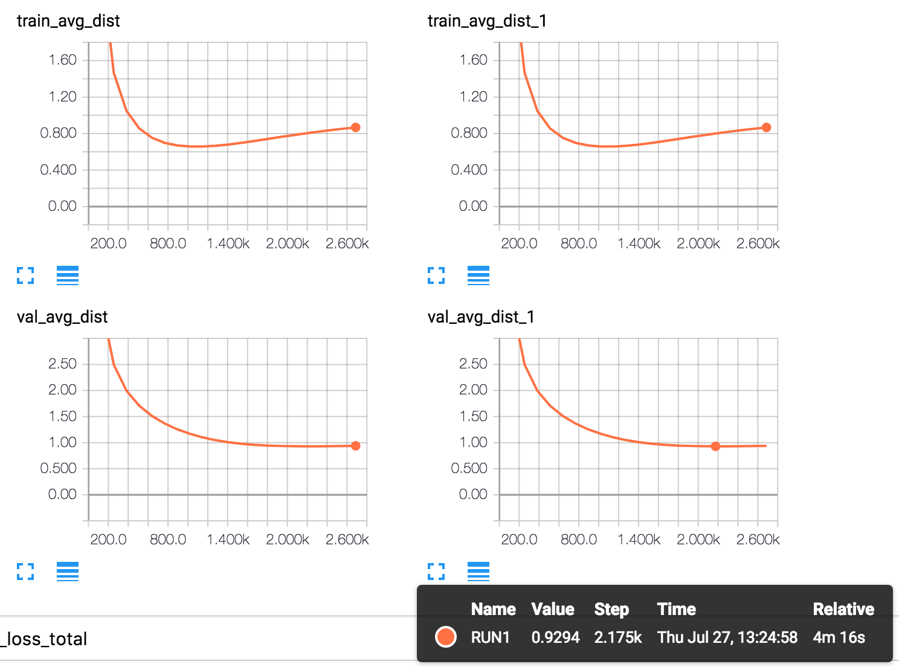
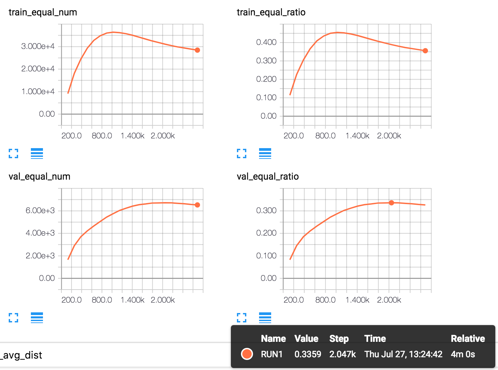

# Model based Collaborative Filtering implemented with Tensorflow

Main recommend system algorithms are listed below.

## 1. Collaborative filtering

### based on neighbors

- based on user
- based on item

idea: find the top similar user/item, recommend what they related with weight(similarity)

### **based on models**

**what this repo implementes**

idea: user/item matrix decomposition, with **feature dim**

## Content based recommend algorithm

With all item features know, find the relationship bewteen user and features, based on user's behavior history.

Different from neighbor based collaborative filtering algorithm. Content based recommend algorithm **take user behavior history into consideration**, while neighbor based collaborative filtering algorithm ignore this.

## Hybrid algorithm

Combine collaborative filtering and content based recommend algorithm, diminishes the shortage of each algorithm. It works like making recommend from each algorithm, and combine them with weights.

# 2. Implementation

## Preprocessing

load the MovieLens 100K Dataset, parse, devide into train/validation dataset, transform to a USER\_NUM \* MOVIE\_NUM matrix with train dataset, ie `train_matrix` in code.

## Tensor Initialization

Set up `tf_train_matrix`, `tf_user_features`, `tf_item_features` tensor, which could be understood as:

```
tf_train_matrix = tf_user_features * tf_item_features.T
```

## Loss Definition

In one word, `train_loss`, which is the training objective, is defined as,

```
train_loss = 0.1 * train_diff_loss + 0.1 * train_user_loss + 0.1 * train_item_loss
```

`train_user_loss` and `train_item_loss` are the regulation terms, root/sum/square of the tf\_user\_features and tf\_item\_features, which prevents overfitting.

`train_diff_loss` is the root squared error of `tf_train_matrix` and `tf_user_features * tf_item_features.T`. You might notice that tf_train_matrix doesn't cover all, since it
s quite common(even mostly) that some users didn't see some movies. So These blanks are fill with the average rating of this movie. If nobody see this movie, rating it 3.

Their weights are all equal, 0.1, which is empirical and observation. Why not all 1, because I want loss smaller which makes me feel good. Big loss is always scary, isn't it?

## Evaluation

### Average Abs Error

`train_avg_dist` and `val_avg_dist` means the average abs rating error between prediction and ground truth.

### Accuracy

`train_equal_num`, `train_equal_ratio`, `val_equal_num`, `val_equal_ratio` stands for the right prediction num and it's ratio of train/test dataset.

## Training

It won't take too much time. I set a lot of scalars to watch in Tensorboard during training. Names of scalars need well organized to utilize the group scalar in Tensorboard.

## Result

The best accuracy is 33.59%, the best average abs error is 0.9294 before overfitting, which means 1/3 prediction are right, and average prediction is 1 rating distance from ground truth, seems to be acceptable in suggestion area.



